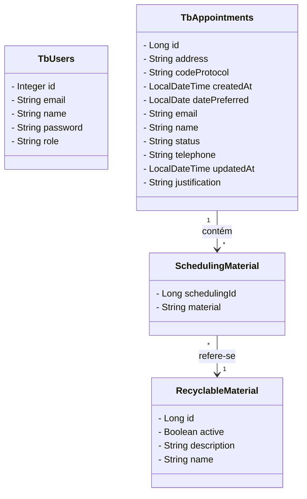

# 🌱 Sistema de Agendamento de Coleta de Materiais Recicláveis

O sistema permite ao cidadão agendar coletas de materiais recicláveis e fornece uma interface administrativa protegida por autenticação para gerenciamento desses agendamentos.

---


## ✅ Visão Geral da Solução

A proposta consiste em uma aplicação web com as seguintes funcionalidades:

- Cadastro de agendamento pelo cidadão (sem necessidade de login);
- Autenticação para usuários administradores;
- Listagem e detalhamento dos agendamentos (restrito a usuários autenticados);
- Atualização do status da coleta;
- (Opcional) Gerenciamento dos tipos de materiais recicláveis.

---

## 🔄 Fluxo da Aplicação

1. O cidadão preenche um formulário com as informações da coleta e envia a solicitação;
2. O sistema valida os dados e registra o agendamento com status **"Pendente"**;
3. Um número de protocolo é gerado e exibido ao cidadão;
4. Um usuário autenticado pode visualizar os agendamentos, filtrar e ordenar por data/status;
5. O administrador pode atualizar o status de cada agendamento para **"Agendado"**, **"Concluído"** ou **"Cancelado"**, com justificativa obrigatória nos dois últimos casos.

---

## 📋 Requisitos Funcionais (RF) e Regras de Negócio (RN)

### RF001 - Solicitar Agendamento de Coleta (Público)

- **RN001.1**: Dados obrigatórios: Nome completo, endereço (rua, número, bairro, cidade), tipo(s) de material, data sugerida (mínimo 2 dias úteis à frente), telefone. E-mail é opcional.
- **RN001.2**: Tipos de materiais devem estar previamente definidos (ex: Papel, Plástico, Vidro, Metal, Eletrônicos).
- **RN001.3**: Campos obrigatórios devem ser validados.
- **RN001.4**: Após envio, o sistema deve:
  - Gerar um número de protocolo único;
  - Retornar uma confirmação com resumo dos dados e data sugerida.

---

### RF002 - Autenticação de Usuários

- **RN002.1**: Login via e-mail e senha;
- **RN002.2**: O backend deve restringir todas as rotas administrativas a usuários autenticados;
- **RN002.3**: (Responsabilidade do frontend) Redirecionamento de usuários não logados para tela de login.

---

### RF003 - Armazenar e Listar Agendamentos

- **RN003.1**: Apenas usuários autenticados podem visualizar agendamentos;
- **RN003.2**: A listagem deve exibir: nome do cidadão, data da coleta, tipos de materiais e status atual;
- **RN003.3**: Filtros por data e status devem estar disponíveis;
- **RN003.4**: Os agendamentos devem ser ordenados por data da coleta (mais próximos primeiro).

---

### RF004 - Detalhamento do Agendamento

- **RN004.1**: O sistema deve fornecer uma visualização completa dos dados fornecidos pelo cidadão;
- **RN004.2**: Apenas usuários autenticados podem acessar o detalhamento.

---

### RF005 - Atualização de Status da Coleta

- **RN005.1**: Status possíveis: **"Pendente"**, **"Agendado"**, **"Concluído"**, **"Cancelado"**;
- **RN005.2**: O sistema deve registrar data e hora da última alteração;
- **RN005.3**: Justificativa é obrigatória ao definir o status como "Concluído" ou "Cancelado".

---

### RF006 - Gerenciar Tipos de Materiais

- **RN006.1**: Deve ser possível cadastrar, editar e excluir tipos de materiais recicláveis;
- **RN006.2**: Cada tipo pode conter uma descrição e uma categoria (ex: seco, orgânico, eletrônico).

---

## 🛠️ Estrutura do Projeto (Backend)

- Java 17
- Spring Boot
- Spring Data JPA
- Spring Security
- PostgreSQL
- JWT (JSON Web Token)
- JUnit 5

---

## 🚀 Como Executar o Projeto

Siga os passos abaixo para rodar o projeto localmente:

### 🔧 Pré-requisitos

Certifique-se de ter instalado:

- Java 17+
- Maven
- PostgreSQL

---

### 🗃️ 1. Criar o Banco de Dados

Crie o banco de dados no PostgreSQL com o seguinte comando:
```sql  
CREATE DATABASE recycle_scheduler;
```

### ⚙️ 2. Configurar o application.properties
No diretório src/main/resources, abra ou crie o arquivo application.properties e adicione as seguintes configurações:

```properties
spring.datasource.url=jdbc:postgresql://localhost:5432/recycle_scheduler
spring.datasource.username=postgres
spring.datasource.password=admin
```

> 🔐 Importante: Lembre-se de substituir username e password pelas suas credenciais do PostgreSQL.


### 📚 Endpoints

Autentificação:
- `POST /auth/login`: Realiza login do usuário administrador, retornando token JWT e dados do usuário.

Agendamento:
- `POST /appointments`: Criar novo agendamento de coleta (público, sem autenticação).
- `GET /appointments`: Listar todos os agendamentos (requer autenticação ADMIN).
- `GET /appointments/{id}`: Obter detalhes de um agendamento específico (ADMIN).
- `PUT /appointments/{id}/status`: Atualizar status do agendamento (ADMIN).
- `GET /appointments/filter`: Filtrar agendamentos por data, status ou material (ADMIN).
- `GET /appointments/protocol/{codeProtocol}`: Buscar agendamento pelo número de protocolo

Materiais:
- `GET /materiais`: Listar todos os tipos de materiais recicláveis (público).
- `POST /materiais`: Criar um novo tipo de material reciclável (ADMIN).
- `PUT /materiais/{id}`: Atualizar um tipo de material reciclável (ADMIN).
- `DELETE /materiais/{id}`: Remover um tipo de material reciclável (ADMIN).

## 📍 Diagrama

